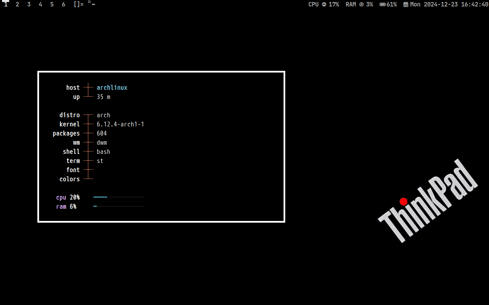
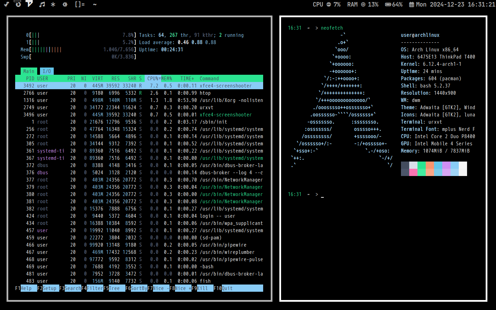

  <h1> <strong>ＢＬＡＣＫ － ＤＷＭ</strong> </h1>

  <h2 style="font-size: 24px;">
    <strong> <a href="https://suckless.org/" style="text-decoration: none; color: inherit;">
      
      Dynamic Window Manager</a> 
    </strong>
  </h2>

<h1>
      

 

  
## ⚙️ Features
- **Window Manager** :bento: [Dwm](https://dwm.suckless.org/)
- **Application Launcher** :rocket: [Dmenu](https://tools.suckless.org/dmenu/)
- **Terminal Emulator** :leaves: [Rxvt](http://software.schmorp.de/pkg/rxvt-unicode.html)
- **Shell** :shell: [Fish](https://fishshell.com/)
- **File Manager** :flower_playing_cards: [Thunar](https://docs.xfce.org/xfce/thunar/start)

  

    
<strong>🚀 Resource Efficiency</strong>

    
Optimized for performance and minimal resource usage. On average, my setup consumes between <strong>150 MB and 300 MB of RAM</strong>, depending on the installed packages and background services. This lightweight configuration maximizes system resources for essential tasks and keeps everything running smoothly.

<h1>
      

 

## 🔑 Key Bindings

#### 📱 **Applications**

- **$mod+q** – KILL  
- **$mod+t** – RXVT
- **$mod+d** – DMENU 

### :octocat: ‎ <samp>HI THERE! THANKS FOR DROPPING BY!</samp>
